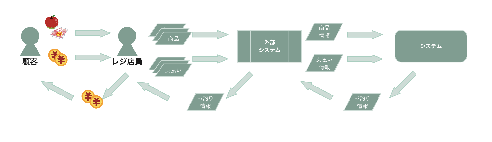

# 空想ビジネス：顧客とレジ店員間における商品と金銭のやりとり：拡張 直打ち商品, 追加オペレーション（2014年以前）/異常系

## 内容

### 登場人物
* レジ店員
* 顧客
* システム（本アプリケーション）
* 外部システム（仮想の入力情報保持アプリケーション）

### レジ店員と顧客が扱う情報

* 商品情報
    * 識別番号（値段はシステム側が保持している情報を活用する）
    * 直打ち（種別番号, 値段）
* 支払い情報
    * 現金

### ユースケース

* フロー
    * 顧客がレジ店員へ商品を渡す
    * レジ店員が外部システムへ商品情報を入力する
    * 顧客が支払いを伝え必要な資材をレジ店員へ渡す
    * レジ店員が支払いに必要な資材の情報を外部システムへ入力する
        * 入力する情報
            * （顧客から受領した場合）商品情報（識別番号）
            * （顧客から受領した場合）商品情報（種別番号:値段）
            * 支払い情報
    * 外部システムがシステムへ連携する
        * 連携する情報
            * （顧客から受領した場合）商品情報（識別番号）
            * （顧客から受領した場合）商品情報（種別番号:値段）
            * 支払い情報
        * 入力した内容を元に、合計金額とお釣りを算出する
            * CLIアプリケーションだが、イメージとしてはレジ端末からAPIが送信されて受け取ったあとの処理
    * 充足している場合
        * レジ店員がシステムからお釣り情報を取得する
        * レジ店員が結果を元にお釣りを顧客に返金する
    * 不足している場合
        * レジ店員がシステムから不足情報を取得する
        * レジ店員が不足している旨を顧客に連絡する
    * 収入印紙の通知
        * 取引の合計金額が3万円以上の場合、収入印紙が必要な旨をレジ店員が取得する
    * 異常系の通知
        * 必要な理由
            * 言語仕様・システム動作環境を超えることによる動作不良を防ぐため
            * レジ店員のオペレーションミスを、システムからレジ店員へ通知するため
            * レジ店員の次の適切な動作の促しをするため
                * 例
                    * 「お釣りが -200円です」よりも「お客様、200円不足しています」のほうが顧客に対するオペレーションとして望ましいと考えている
        * 識別番号
            * 100文字を超えるとき
            * 個数が50個を超えるとき
            * 存在しないとき
        * 直打ち
            * 個数が50個を超えるとき
            * 種別番号
                * 100文字を超えるとき
            * 値段
                * 数字でないとき
                * 1,000,000円を超えるとき
        * 支払い情報：金額
            * 数字でないとき
            * 1,000,000円を超えるとき
        * 取引
            * 合計商品数が100個を超えるとき
            * 合計金額が1,000,000円を超えるとき
        * 支払い情報：金額よりも取引全体の合計金額が大きいとき（＝不足している場合）

### 具体例

#### 2つの商品を現金で購入する

1. 顧客が以下商品の購入意思をレジ店員へ伝える
    * ハム（加工肉）
        * 識別番号
            * 001
    * オレンジジュース
        * 識別番号
            * 002
2. レジ店員が外部システムに受領した商品を登録する
3. 顧客が対応する現金をレジ店員へ渡す
4. レジ店員が外部システムに受領した現金を登録する
5. レジ店員が外部システムで確定を実施する
6. 外部システムがシステムへ商品情報と支払い情報を連携する
7. システムが外部システムへお釣り情報を連携する
8. 外部システムがレジ店員へお釣り情報を連携する
9. レジ店員が外部システムよりお釣り情報を元に現金を取得する
10. レジ店員が顧客へ現金を返却する

#### 2つの商品（商品番号を1つ、種別番号, 値段を1つ）を現金で購入する
1. 顧客が以下商品の購入意思をレジ店員へ伝える
    * ハム（加工肉）
        * 識別番号
            * 001
    * 白菜1/2カット
        * 種別番号
            * 831
        * 値段
            * 120円
2. 以降は[上記](README.md#2つの商品を現金で購入する)と同様

#### 2つの商品（種別番号, 値段を2つ）を現金で購入する
1. 顧客が以下商品の購入意思をレジ店員へ伝える
    * 豚肉200g
        * 種別番号
            * 029
        * 値段
            * 300円
    * 白菜1/2カット
        * 種別番号
            * 831
        * 値段
            * 120円
2. 以降は[上記](README.md#2つの商品を現金で購入する)と同様

#### 2つの商品（種別番号, 値段を2つ、かつ同じ種別番号）を現金で購入する
1. 顧客が以下商品の購入意思をレジ店員へ伝える
    * きゅうり
        * 種別番号
            * 831
        * 値段
            * 300円
    * 白菜1/2カット
        * 種別番号
            * 831
        * 値段
            * 120円
2. 以降は[上記](README.md#2つの商品を現金で購入する)と同様

#### 1つの商品（種別番号, 値段）30,000円以上を現金で購入する

1. 顧客が以下商品の購入意思をレジ店員へ伝える
    * 時計
        * 種別番号
            * 121
        * 値段
            * 35,000円
2. 以降は[上記「外部システムがシステムへ商品情報と支払い情報を連携する」まで](README.md#2つの商品を現金で購入する)と同様
3. システムが外部システムへお釣り情報（収入印紙情報込み）を連携する
4. 外部システムがレジ店員へお釣り情報（収入印紙情報込み）を連携する
5. レジ店員が外部システムよりお釣り情報（収入印紙情報込み）を元に現金を取得する
6. レジ店員が顧客へ現金と収入印紙を返却する

#### 2つの商品（商品番号を1つ、種別番号, 値段を1つ）の合計30,000円以上を現金で購入する

1. 顧客が以下商品の購入意思をレジ店員へ伝える
    * ハム（加工肉）
        * 識別番号
            * 001
    * 時計
        * 種別番号
            * 121
        * 値段
            * 29,900円
2. 以降は[上記「外部システムがシステムへ商品情報と支払い情報を連携する」まで](README.md#2つの商品を現金で購入する)と同様
3. システムが外部システムへお釣り情報（収入印紙情報込み）を連携する
4. 外部システムがレジ店員へお釣り情報（収入印紙情報込み）を連携する
5. レジ店員が外部システムよりお釣り情報（収入印紙情報込み）を元に現金を取得する
6. レジ店員が顧客へ現金と収入印紙を返却する

#### 顧客が誤って合計金額より少ない支払い情報をレジ店員に伝える

1. 顧客が以下商品の購入意思をレジ店員へ伝える
    * ハム（加工肉）
        * 識別番号
            * 001
    * 白菜1/2カット
        * 種別番号
            * 831
        * 値段
            * 120円
2. レジ店員が外部システムに受領した商品を登録する
3. 顧客が対応する現金（合計より少ない値）をレジ店員へ渡す
4. レジ店員が外部システムに受領した現金を登録する
5. レジ店員が外部システムで確定を実施する
6. 外部システムがシステムへ商品情報と支払い情報を連携する
7. システムが外部システムへ異常通知を連携する
8. 外部システムがレジ店員へ異常通知を連携する
9. レジ店員が外部システムより異常通知を取得する

#### 顧客誤って伝えるまたはレジ店員が誤って存在しない識別番号の商品を外部システムに入力する

1. レジ店員が外部システムに以下を商品として登録する
    * 存在しない商品
        * 識別番号
            * 99999
2. 顧客が対応する現金をレジ店員へ渡す
3. レジ店員が外部システムに受領した現金を登録する
4. レジ店員が外部システムで確定を実施する
5. 外部システムがシステムへ商品情報と支払い情報を連携する
6. システムが外部システムへ異常通知を連携する
7. 外部システムがレジ店員へ異常通知を連携する
8. レジ店員が外部システムより異常通知を取得する

### 全体イメージ

