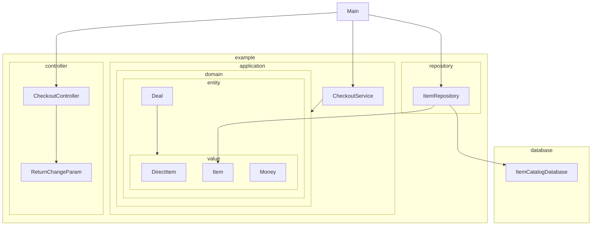

# 空想ビジネス：サンプルコード 顧客とレジ店員間における商品と金銭のやりとり

## 構成

クラスの依存関係は、`A ---> B` と記載されている場合、`AがBをImportする` という依存関係です。



## 手順

コンテナ等は存在しません、
Mainクラス実行にて動作します
Scannerによって、コンソール上の標準入力を受け取ります

* 1行目：商品情報：識別番号カンマ区切り（ `ItemCatalogDatabaseにおける、001, 002` ）
* 2行目：商品情報：種別番号:値段カンマ区切り（ `任意の種別番号1:任意の値段1,任意の種別番号2:任意の値段2...`
）
* 3行目：支払い情報：金額（ `任意の値段` ）

```shell
./gradlew run
```
